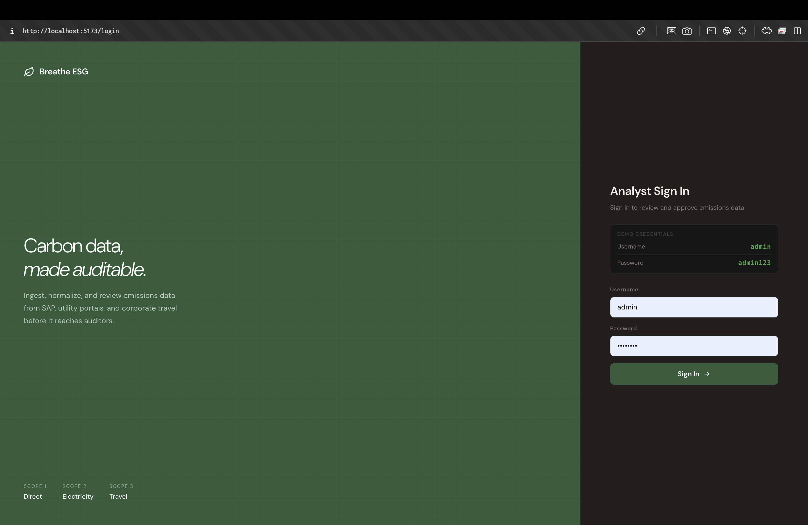
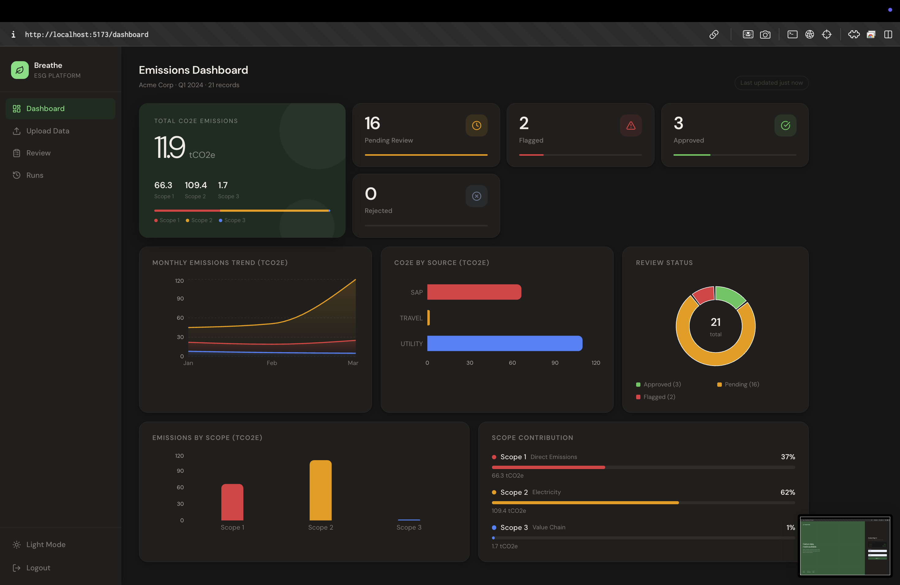
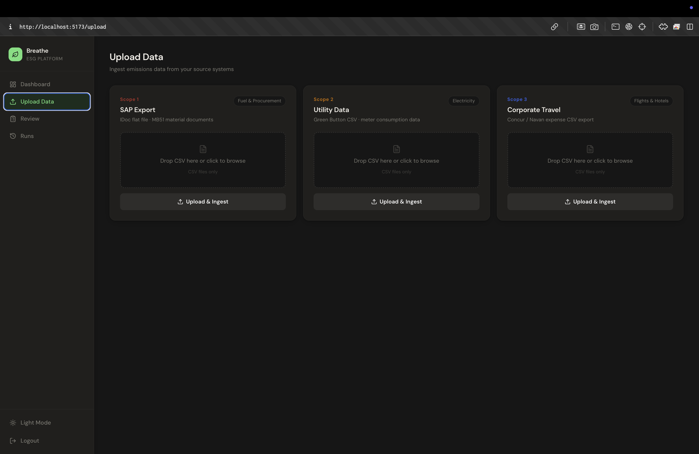
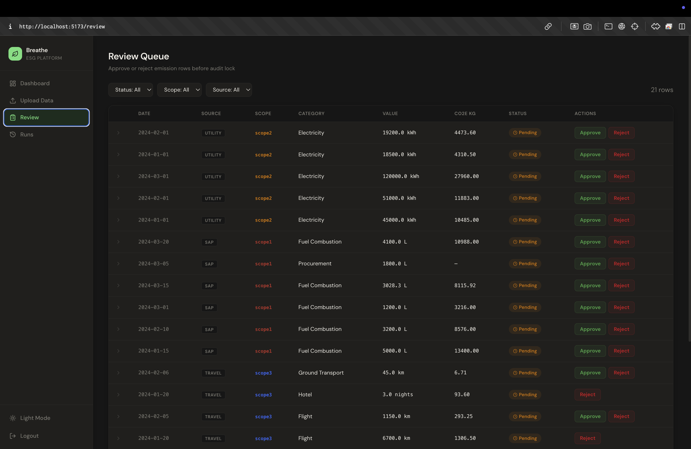

# 🌿 Breathe ESG — Emissions Data Ingestion & Review Platform

> A production-grade prototype for ingesting, normalizing, and auditing enterprise carbon emissions data — built for the Breathe ESG Tech Intern Assignment.

[](https://djangoproject.com)
[](https://reactjs.org)
[](https://python.org)
[](https://postgresql.org)
[](https://render.com)
[](https://vercel.com)

---

## 🔗 Live Demo

| | URL |
|---|---|
| **Frontend** | https://breathe-esg-lemon-five.vercel.app |
| **Backend API** | https://breathe-esg-2ec3.onrender.com/api |
| **Username** | `admin` |
| **Password** | `admin123` |

## 📸 Screenshots

### Login


---

### Emissions Dashboard


---

### Upload Data


---

### Review Queue



---

## 📋 Table of Contents

- [The Problem](#-the-problem)
- [What I Built](#-what-i-built)
- [System Architecture](#-system-architecture)
- [Data Flow](#-data-flow)
- [Data Sources](#-data-sources)
- [Data Model](#-data-model)
- [Tech Stack](#-tech-stack)
- [Features](#-features)
- [Local Setup](#-local-setup)
- [API Reference](#-api-reference)
- [Key Decisions](#-key-decisions)
- [Tradeoffs](#-tradeoffs)
- [Folder Structure](#-folder-structure)

---

## 🎯 The Problem

Enterprise clients have emissions data scattered across:
- **SAP** — fuel and procurement in IDoc flat file exports with German headers, inconsistent units, plant codes
- **Utility Portals** — electricity data in Green Button CSVs with billing periods that don't align to calendar months
- **Concur / Navan** — travel expenses with airport codes instead of distances, mixed categories

The hard part isn't computing carbon — it's that every client's data lives somewhere different, in a different shape, with different gaps.

---

## 🛠 What I Built

A **Django REST + React** web application that:

1. **Ingests** raw CSV files from all three source types
2. **Normalizes** units (litres, kWh, km), detects Scope 1/2/3 category, applies emission factors
3. **Flags** suspicious rows automatically (zero values, unit conversions, unusually high values)
4. **Surfaces** a review dashboard where analysts approve/reject rows before audit lock
5. **Tracks** full audit trail — who changed what, when, and why

---

## 🏗 System Architecture

```
┌─────────────────────────────────────────────────────────────────┐
│                        ANALYST BROWSER                          │
│                  React SPA (Vercel)                             │
│         Dashboard │ Upload │ Review │ Ingestion Runs            │
└──────────────────────────┬──────────────────────────────────────┘
                           │ HTTPS / JWT Auth
                           ▼
┌─────────────────────────────────────────────────────────────────┐
│                    DJANGO REST API (Render)                      │
│                                                                  │
│   ┌────────────┐  ┌─────────────┐  ┌──────────────────────┐    │
│   │  accounts  │  │  ingestion  │  │       parsers        │    │
│   │  User      │  │  Upload API │  │  sap_parser.py       │    │
│   │  Client    │  │  Review API │  │  utility_parser.py   │    │
│   │  JWT Auth  │  │  Stats API  │  │  travel_parser.py    │    │
│   └────────────┘  └─────────────┘  └──────────────────────┘    │
└──────────────────────────┬──────────────────────────────────────┘
                           │
                           ▼
┌─────────────────────────────────────────────────────────────────┐
│                    PostgreSQL DATABASE                           │
│                                                                  │
│   Client → DataSource → IngestionRun → EmissionRow → AuditLog   │
└─────────────────────────────────────────────────────────────────┘
```

---

## 🔄 Data Flow

```
CSV File Upload
      │
      ▼
┌─────────────┐     ┌──────────────────────────────────────┐
│  Upload API │────▶│  Parser (SAP / Utility / Travel)     │
└─────────────┘     │                                      │
                    │  1. Detect encoding (UTF-8 / Latin-1)│
                    │  2. Map column names → standard keys │
                    │  3. Parse dates (YYYYMMDD, DD.MM.YYYY│
                    │  4. Normalize units → SI             │
                    │     Fuel:       GAL → L, KG → L      │
                    │     Electricity: MWh → kWh           │
                    │     Distance:   airport codes → km   │
                    │  5. Apply emission factor            │
                    │  6. Compute CO2e (kg)                │
                    └──────────────┬───────────────────────┘
                                   │
                                   ▼
                    ┌──────────────────────────────────────┐
                    │  Auto-flagging Rules                 │
                    │  • Zero or missing value             │
                    │  • CO2e > 100,000 kg (unusually high)│
                    │  • Unit conversion applied           │
                    └──────────────┬───────────────────────┘
                                   │
                                   ▼
                    ┌──────────────────────────────────────┐
                    │  EmissionRow saved to DB             │
                    │  status: pending | flagged           │
                    └──────────────┬───────────────────────┘
                                   │
                                   ▼
                    ┌──────────────────────────────────────┐
                    │  Analyst Review Dashboard            │
                    │  • View all rows, filter by scope    │
                    │  • Expand row → see raw data         │
                    │  • Approve / Reject                  │
                    │  • AuditLog written on every change  │
                    └──────────────┬───────────────────────┘
                                   │
                                   ▼
                    ┌──────────────────────────────────────┐
                    │  Approved rows → is_locked = True    │
                    │  Ready for auditor export            │
                    └──────────────────────────────────────┘
```

---

## 📊 Data Sources

### 1. SAP — Fuel & Procurement (Scope 1)

| Decision | Choice | Reason |
|---|---|---|
| Format | IDoc flat file CSV | Most universally available SAP export. Every installation supports SM35/LSMW flat file. OData/BAPI requires middleware config most clients don't have. |
| Columns handled | WERKS, MATNR, MENGE, MEINS, BLDAT, BKTXT, LIFNR | Standard MB51 material document export fields |
| Date formats | YYYYMMDD, DD.MM.YYYY, MM/DD/YYYY | SAP exports vary by system locale |
| Unit normalization | L, GAL→L (×3.785), KG→L (÷0.832), M3→L (×1000) | Standardize to litres for fuel combustion calculation |
| Emission factor | 2.68 kg CO₂e/L | IPCC 2006 Guidelines, Table 2.2 (diesel) |

**Sample data looks like this because:** Real SAP MB51 exports use German column headers (WERKS = plant, MATNR = material, MEINS = unit of measure). Mixed units (L and GAL) and non-fuel procurement rows test the normalization and category detection logic.

---

### 2. Utility Portal — Electricity (Scope 2)

| Decision | Choice | Reason |
|---|---|---|
| Format | Green Button CSV | US/EU standard for utility data export. Supported by most major utilities (PG&E, National Grid, BESCOM). PDF parsing is fragile; API requires per-utility OAuth. |
| Columns handled | meter_id, consumption, unit, start_date, end_date, location, tariff | Core Green Button data fields |
| Unit normalization | kWh (base), MWh×1000, GWh×1,000,000 | Standardize to kWh |
| Billing period | Stored as billing_period_start/end, separate from activity_date | Billing periods ≠ calendar months — critical for Scope 2 reporting |
| Emission factor | 0.233 kg CO₂e/kWh | DEFRA 2023, UK grid average (location-based) |

---

### 3. Corporate Travel — Flights, Hotels, Ground (Scope 3)

| Decision | Choice | Reason |
|---|---|---|
| Format | Concur expense CSV export | Dominant corporate travel platform. CSV export is what finance teams actually download for reconciliation. |
| Distance calculation | Haversine from IATA airport coordinates | Concur exports have origin/destination codes but often no distance. Great-circle calculation is standard for flight estimation. |
| Emission factors | Short-haul: 0.255, Long-haul: 0.195 kg CO₂e/km | DEFRA 2023, split at 3,700 km threshold |
| Hotel factor | 31.2 kg CO₂e/night | DEFRA 2023 |
| Ground transport | Taxi: 0.149, Train: 0.041, Car: 0.192 kg CO₂e/km | DEFRA 2023 |

---

## 🗃 Data Model

```
┌──────────────┐       ┌──────────────────┐       ┌─────────────────┐
│    Client    │──────▶│   DataSource     │──────▶│  IngestionRun   │
│              │  1:N  │                  │  1:N  │                 │
│  id          │       │  id              │       │  id             │
│  name        │       │  client FK       │       │  source FK      │
│  slug        │       │  source_type     │       │  triggered_by   │
└──────────────┘       │  (sap/util/trvl) │       │  status         │
       │               └──────────────────┘       │  file_name      │
       │                                          │  success_count  │
       │                                          │  error_count    │
       │                                          │  error_log      │
       │                                          └────────┬────────┘
       │                                                   │
       │               ┌──────────────────────────────────▼──────────┐
       └──────────────▶│              EmissionRow                    │
                  1:N  │                                              │
                       │  client FK          scope (1/2/3)           │
                       │  ingestion_run FK   category                 │
                       │                                              │
                       │  raw_value          normalized_value         │
                       │  raw_unit           normalized_unit          │
                       │  raw_data (JSON)    emission_factor          │
                       │                     co2e_kg                  │
                       │  activity_date      billing_period_start/end │
                       │  location           vendor                   │
                       │                                              │
                       │  status (pending/flagged/approved/rejected)  │
                       │  flagged_reason     is_locked                │
                       │  reviewed_by FK     reviewed_at              │
                       └──────────────────────┬───────────────────────┘
                                              │
                                              ▼ 1:N
                       ┌──────────────────────────────────────────────┐
                       │                 AuditLog                     │
                       │                                              │
                       │  emission_row FK   changed_by FK             │
                       │  changed_at        field_name                │
                       │  old_value         new_value                 │
                       │  note                                        │
                       └──────────────────────────────────────────────┘
```

**Key design decisions:**
- `raw_data` JSONField stores the full original row — nothing is ever lost
- `is_locked` prevents edits after audit export
- `AuditLog` captures every field change with old/new value
- Every query is scoped to `client` — full multi-tenancy

---

## ⚙️ Tech Stack

| Layer | Technology | Reason |
|---|---|---|
| Backend | Django 5.1 + Django REST Framework | Battle-tested, strong ORM, built-in admin for data inspection |
| Authentication | JWT via SimpleJWT | Stateless, works cleanly with React SPA |
| Database | PostgreSQL (prod) / SQLite (dev) | Postgres for production reliability; SQLite for zero-config local dev |
| Frontend | React 18 + Vite | Fast builds, excellent DX |
| Charts | Recharts | Composable, works well with React state |
| HTTP Client | Axios | Interceptors for JWT refresh logic |
| Styling | CSS custom properties (dark/light mode) | No build-time dependency, instant theme switching |
| Backend Deploy | Render | Free tier, Postgres included, auto-deploy from GitHub |
| Frontend Deploy | Vercel | Instant static deploys, free tier, excellent Vite support |
| Data parsing | Pandas | Handles encoding detection, flexible CSV parsing |

---

## ✨ Features

### 📤 Data Ingestion
- Drag-and-drop CSV upload for all 3 source types
- Automatic encoding detection (UTF-8 / Latin-1)
- Flexible column name matching (German SAP headers supported)
- Multi-format date parsing (YYYYMMDD, DD.MM.YYYY, MM/DD/YYYY)
- Unit normalization on ingest
- Haversine distance calculation from IATA airport codes

### 🔍 Review Dashboard
- Filter by scope (1/2/3), status, source type
- Expandable rows showing raw data, emission factors, flag reasons
- One-click approve / reject
- Flagged rows highlighted automatically
- Audit log on every status change

### 📊 Analytics Dashboard
- Total approved CO₂e in tCO₂e
- Breakdown by Scope 1 / 2 / 3
- Monthly emissions trend (area chart)
- Records by source (horizontal bar)
- Review status donut chart
- Scope contribution progress bars

### 🔒 Audit Trail
- Every field change logged with old/new value
- `is_locked` flag prevents post-audit edits
- `reviewed_by` and `reviewed_at` on every approved row
- Full ingestion run history with error logs

### 🌙 Dark / Light Mode
- Persistent theme preference
- Defaults to dark mode
- Toggle in sidebar

---

## 🚀 Local Setup

### Prerequisites
- Python 3.11+
- Node.js 18+
- Git

### Backend
```bash
git clone https://github.com/AkashParley/breathe-esg.git
cd breathe-esg/backend

python3 -m venv venv
source venv/bin/activate

pip install -r requirements.txt

# Create .env file
cat > .env << 'EOF'
DEBUG=True
SECRET_KEY=django-insecure-local-dev-key
ALLOWED_HOSTS=localhost,127.0.0.1
EOF

python manage.py migrate
python manage.py createsuperuser
python seed.py  # loads sample data

python manage.py runserver
# API running at http://127.0.0.1:8000
```

### Frontend
```bash
cd breathe-esg/frontend

npm install

# Create .env file
echo "VITE_API_URL=http://127.0.0.1:8000/api" > .env

npm run dev
# App running at http://localhost:5173
```

### Sample Data Files
Ready-to-upload CSV files are in `/sample_data/`:
- `sap_export_q1.csv` — SAP fuel & procurement (Scope 1)
- `utility_jan_mar.csv` — Electricity consumption (Scope 2)
- `concur_q1.csv` — Corporate travel (Scope 3)

---

## 📡 API Reference

| Method | Endpoint | Description |
|---|---|---|
| `POST` | `/api/auth/login/` | Get JWT access + refresh tokens |
| `POST` | `/api/auth/refresh/` | Refresh access token |
| `GET` | `/api/accounts/me/` | Current user + client info |
| `POST` | `/api/upload/` | Upload CSV file (source_type + file) |
| `GET` | `/api/rows/` | List emission rows (filterable) |
| `PATCH` | `/api/rows/:id/` | Update row status (approve/reject) |
| `GET` | `/api/dashboard/` | Aggregated stats for dashboard |
| `GET` | `/api/runs/` | List all ingestion runs |

**Query params for `/api/rows/`:**
- `?scope=scope1` — filter by scope
- `?status=flagged` — filter by status
- `?source_type=sap` — filter by source
- `?category=flight` — filter by category

---

## 🧠 Key Decisions

### Why IDoc flat file for SAP?
OData services and BAPIs require middleware configuration that most client IT teams haven't set up. Every SAP installation supports flat file export via SM35/LSMW. IDoc CSV is what SAP operations teams actually email or push over SFTP.

### Why Green Button CSV for utilities?
Green Button is the NAESB REQ.21 standard adopted by most major utilities. PDF parsing is fragile and expensive. API access requires per-utility OAuth integrations that can't be generalised across clients. CSV export is what facilities teams actually do monthly.

### Why Concur CSV for travel?
Concur is the dominant corporate travel platform. Their expense report CSV is well-documented and what finance teams download for reconciliation. Navan's API requires OAuth which adds integration complexity not warranted for a prototype.

### Why SQLite for development?
Zero-config. No Postgres installation required. The data model is identical — switching to Postgres in production is one env var change (`DATABASE_URL`).

### Why JWT over sessions?
JWT is stateless and works cleanly with a React SPA. Django session auth requires CSRF handling complexity that adds noise without benefit in this architecture.

---

## ⚖️ Tradeoffs (What I Deliberately Did Not Build)

### 1. Real-time API pulls
**Not built:** Scheduled pulls from live SAP OData, utility APIs, or Concur OAuth.
**Why:** Each requires per-client credential management, OAuth flows, and per-utility integration work. File upload demonstrates the same normalization pipeline.
**How to add:** Celery + django-celery-beat, per-source credential model, OAuth token refresh.

### 2. Maker-checker approval workflow
**Not built:** Two-level approval where analyst flags and manager signs off.
**Why:** The data model supports it (`reviewed_by`, `is_locked`) but the UI workflow adds significant complexity out of scope for 4 days.
**How to add:** `manager_approved_by/at` fields, MANAGER role, lock only after both approvals.

### 3. Emission factor management UI
**Not built:** Interface to update emission factors per region/year.
**Why:** Factors are hardcoded (DEFRA 2023). A factor management UI with versioning and effective dates is a significant feature.
**How to add:** `EmissionFactor` model with `(category, region, year, value, effective_from, effective_to)`.

---

## 📁 Folder Structure

```
breathe-esg/
├── backend/
│   ├── accounts/
│   │   ├── models.py          # Client, User (multi-tenancy)
│   │   ├── serializers.py
│   │   ├── views.py           # /me endpoint
│   │   └── urls.py
│   ├── ingestion/
│   │   ├── models.py          # DataSource, IngestionRun, EmissionRow, AuditLog
│   │   ├── serializers.py
│   │   ├── views.py           # Upload, Review, Dashboard, Runs APIs
│   │   ├── urls.py
│   │   └── parsers/
│   │       ├── sap_parser.py      # SAP IDoc flat file parser
│   │       ├── utility_parser.py  # Green Button CSV parser
│   │       └── travel_parser.py   # Concur/Navan CSV parser
│   ├── config/
│   │   ├── settings.py
│   │   └── urls.py
│   ├── seed.py                # Realistic sample data loader
│   └── requirements.txt
├── frontend/
│   └── src/
│       ├── pages/
│       │   ├── Dashboard.jsx  # Charts, CO2e totals, scope breakdown
│       │   ├── Upload.jsx     # Drag-and-drop CSV upload
│       │   ├── Review.jsx     # Approve/reject queue with filters
│       │   └── Runs.jsx       # Ingestion run history
│       ├── components/
│       │   └── Layout.jsx     # Sidebar, dark/light mode toggle
│       └── api.js             # Axios instance with JWT interceptors
├── sample_data/
│   ├── sap_export_q1.csv      # SAP fuel & procurement sample
│   ├── utility_jan_mar.csv    # Green Button electricity sample
│   └── concur_q1.csv          # Concur travel sample
└── docs/
    ├── MODEL.md               # Data model deep-dive
    ├── DECISIONS.md           # Every ambiguity resolved
    ├── TRADEOFFS.md           # What was not built and why
    └── SOURCES.md             # Real-world format research
```

---

## 📝 Assignment Docs

| Document | Description |
|---|---|
| [`docs/MODEL.md`](docs/MODEL.md) | Full data model with schema, field-by-field reasoning, multi-tenancy design |
| [`docs/DECISIONS.md`](docs/DECISIONS.md) | Every format choice justified, what I'd ask the PM |
| [`docs/TRADEOFFS.md`](docs/TRADEOFFS.md) | Three deliberate non-builds with reasoning |
| [`docs/SOURCES.md`](docs/SOURCES.md) | Real-world format research for all 3 sources |

---

## 👨‍💻 Author

**Akash Parley**
Built for the Breathe ESG Tech Intern Assignment · May 2026

---

<div align="center">
  <sub>Built with Django · React · PostgreSQL · Deployed on Render + Vercel</sub>
</div>
